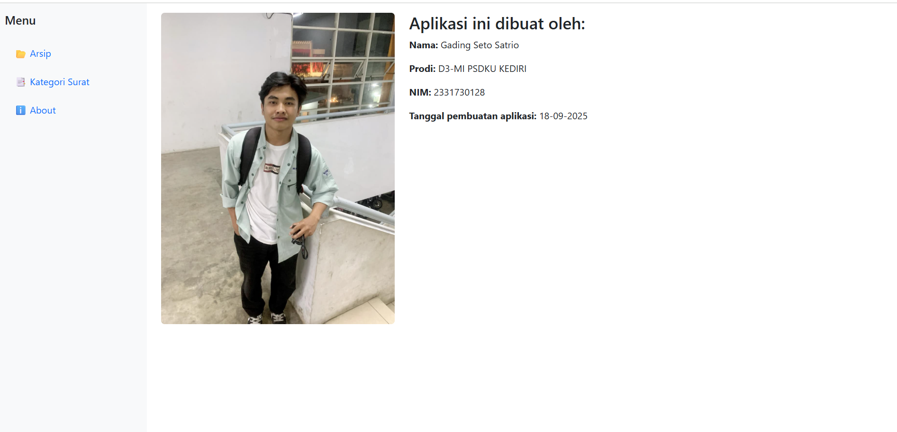
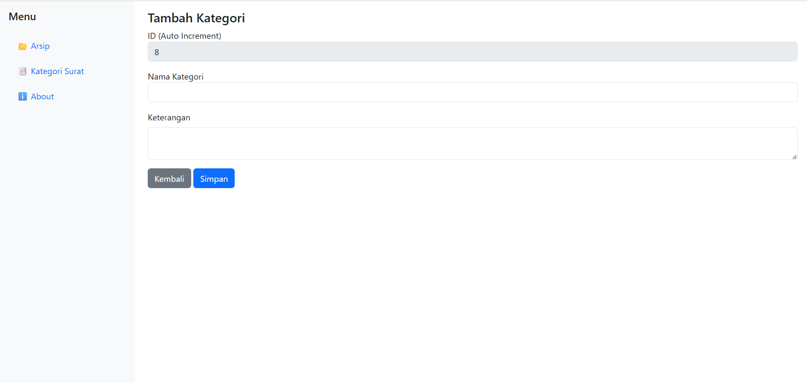
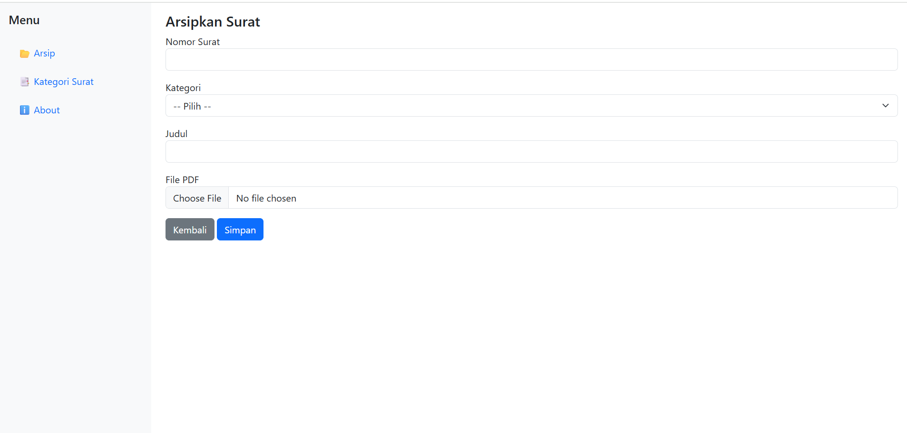
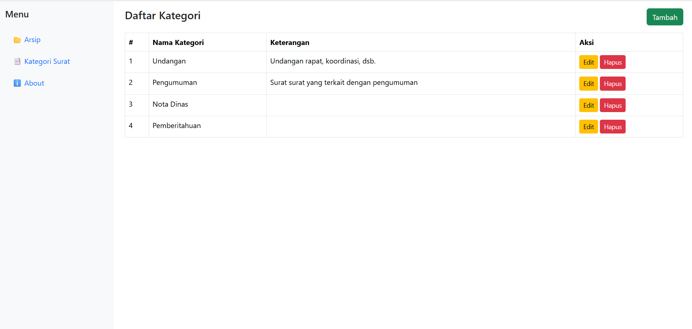
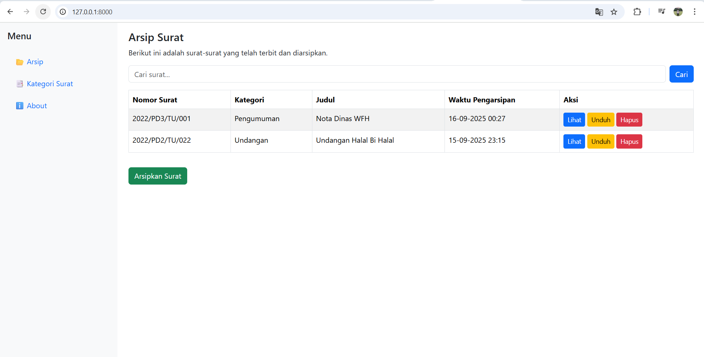
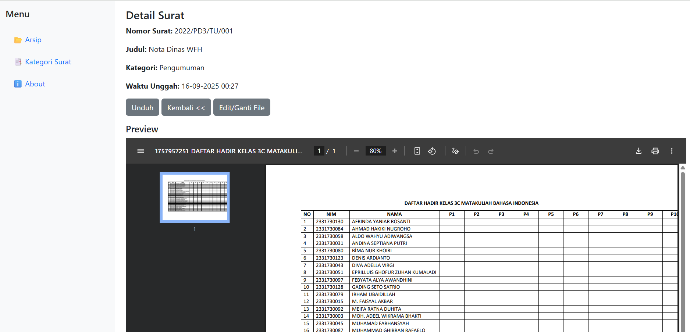

# 📂 Aplikasi Arsip Surat Digital Berbasis Web

## 🎯 Tujuan
Aplikasi ini dibuat untuk mengelola arsip surat masuk/keluar secara digital. Dengan adanya aplikasi ini, proses penyimpanan, pencarian, dan manajemen surat menjadi lebih mudah, terstruktur, dan aman.

## ✨ Fitur Utama
- 📑 **Manajemen Kategori Surat** (Tambah, Edit, Hapus)
- 📂 **Manajemen Data Surat** (CRUD Surat)
- 📥 **Upload & Download Surat dalam format PDF**
- 🖼️ **Halaman About** berisi identitas pembuat aplikasi
- 🔍 **Pencarian surat berdasarkan judul**

## ⚙️ Cara Menjalankan Aplikasi
1. Clone repository ini:
   ```bash
   git clone https://github.com/gadingss/arsip_surat.git

2. Masuk ke folder projek
   cd arsip_surat
3. Install dependecy
   composer install
4. Salin file .env.example menjadi .env lalu sesuaikan konfigurasi database:
   DB_DATABASE=arsip_surat
   DB_USERNAME=root
   DB_PASSWORD=
5. Import database:
   Buka phpMyAdmin
   Buat database dengan nama arsip_surat
   Import file database/arsip_surat.sql
6. Jalankan server
   php artisan serve
7. Akses melalui browser
   http://127.0.0.1:8000
## Screenshot

### Halaman About


### Buat Kategori


### Buat Surat


### Daftar Kategori


### Daftar Surat


### Lihat Surat


